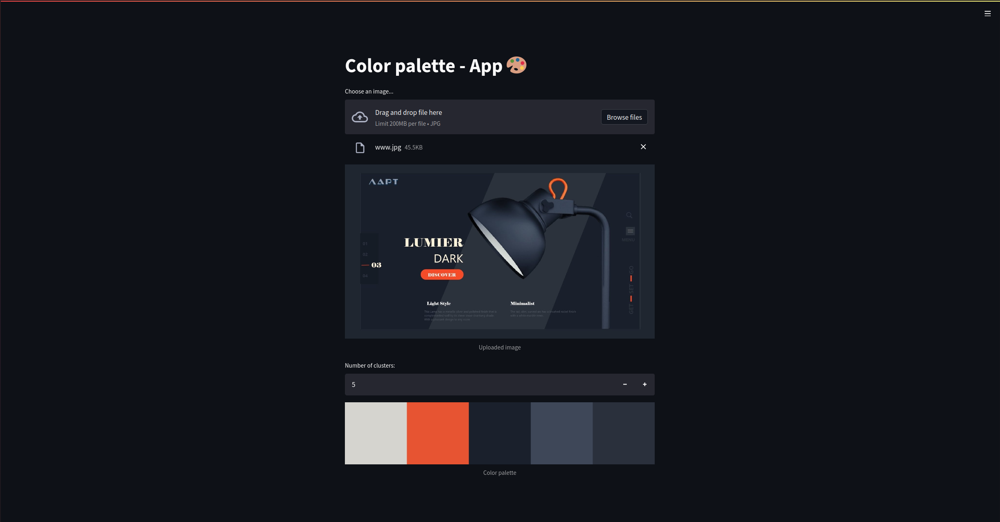

# Color Palette - App 🎨



# Tech stack: 💻
- Python
- OpenCV
- Scikit-Learn
- Streamlit
- FastAPI

# Guide: 📓 

1. Download repo
    ```
    $ git clone https://github.com/MalarzDawid/Dominant
    ```
2. Create virtualenv
    ```bash
    $ virtualenv env
    ```
3. Install dependencies
    ```
    $ pip install -r requirements.txt
    ```
4. Run streamlit app
    ```bash
    $ streamlit run dominant/app.py
    ```
5. Click here => [Click](http://localhost:8501)
